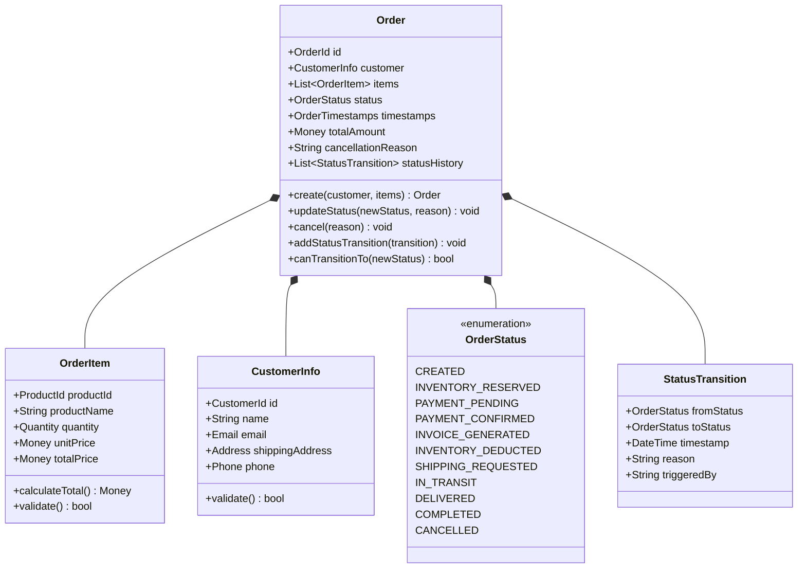
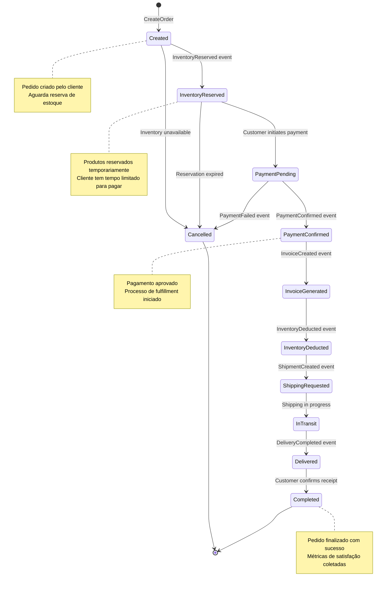
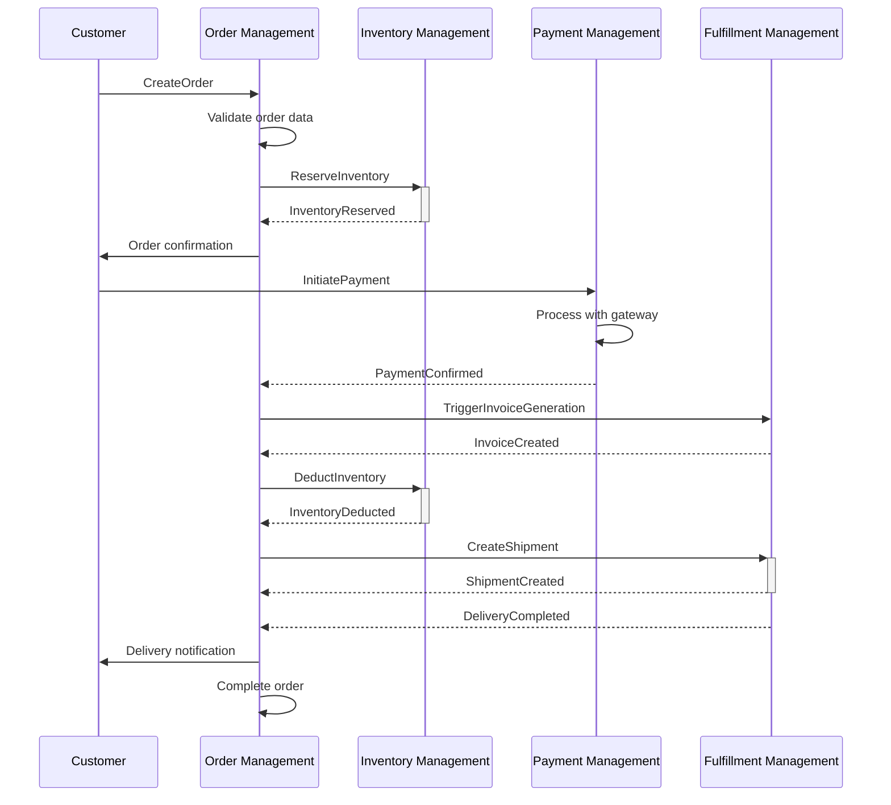
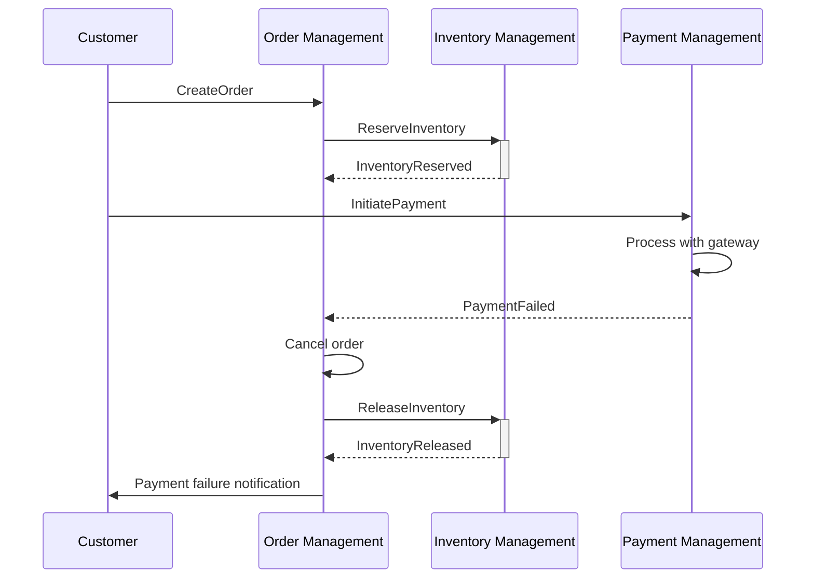
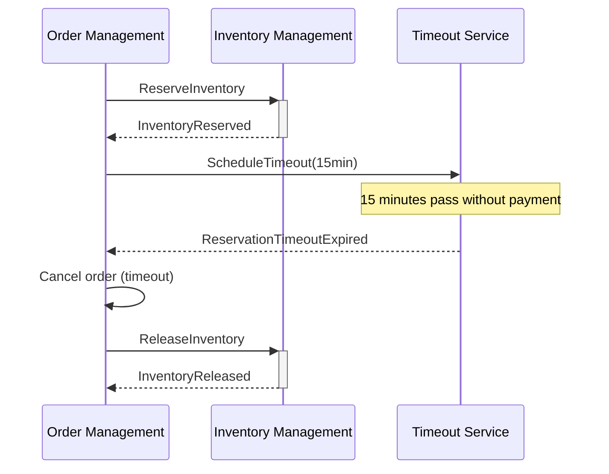

# Order Management - Bounded Context

## Descrição do Domínio e Responsabilidades

O **Order Management** é o bounded context central da loja Bazarium, responsável pela **coordenação e gerenciamento do ciclo de vida completo dos pedidos**. Atua como o **ponto focal de orquestração** do processo de checkout, mantendo a visão consolidada do estado do pedido e reagindo aos eventos de outros contextos de forma coordenada.

### Propósito Central
> *"Gerenciar o ciclo de vida completo dos pedidos, desde a criação até a finalização, garantindo visibilidade, rastreabilidade e consistência do processo para o cliente."*

### Responsabilidades Funcionais
- **Coordenação de Pedidos:** Centraliza o controle do fluxo de checkout e fulfillment
- **Estado Consolidado:** Mantém a "única fonte da verdade" sobre o status dos pedidos
- **Orquestração de Eventos:** Reage e coordena eventos de outros bounded contexts
- **Experiência do Cliente:** Fornece visibilidade completa do progresso do pedido
- **Rastreabilidade:** Mantém histórico completo de todas as transições de estado
- **Consistência:** Garante integridade do processo de pedido através de validações

### Limites do Contexto
**O que está DENTRO:**
- Criação e validação de pedidos
- Gerenciamento de status e transições
- Coordenação do processo de checkout
- Rastreabilidade de mudanças de estado
- Políticas de reação a eventos externos

**O que está FORA:**
- Processamento de pagamentos (Payment Processing BC)
- Gestão de estoque (Inventory Management BC) 
- Geração de faturas e entrega (Fulfillment & Logistics BC)
- Catálogo de produtos (Product Catalog BC)
- Notificações ao cliente (Notification BC)

## Modelagem de Domínio

### Agregados e Entidades

#### Order (Agregado Raiz)
**Descrição:** Representa um pedido realizado pelo cliente, controlando todo o ciclo de vida desde criação até finalização ou cancelamento.

**Entidades e Objetos de Valor:**

**Estados e Transições:**

### Comandos de Domínio

#### CreateOrder
- **Descrição:** Cria um novo pedido para o cliente com validação completa de produtos e dados
- **Agregado Alvo:** Order
- **Atores Possíveis:** Customer
- **Eventos Resultantes:** OrderCreated
- **Validações/Regras:**
  - Produtos existem no catálogo
  - Quantidades são válidas (> 0)
  - Dados do cliente estão completos
  - Email em formato válido
  - Endereço de entrega válido
  - Total do pedido calculado corretamente

#### UpdateOrderStatus
- **Descrição:** Atualiza o status do pedido seguindo as regras de transição de estado
- **Agregado Alvo:** Order
- **Atores Possíveis:** Sistema (Policy)
- **Eventos Resultantes:** OrderUpdated
- **Validações/Regras:**
  - Transição de status é válida conforme máquina de estados
  - Pedido existe e não está cancelado
  - Motivo da mudança é fornecido
  - Timestamp de atualização é registrado

#### CancelOrder
- **Descrição:** Cancela um pedido registrando o motivo e iniciando processo de limpeza
- **Agregado Alvo:** Order
- **Atores Possíveis:** Customer, Sistema (Policy), Operador
- **Eventos Resultantes:** OrderCancelled
- **Validações/Regras:**
  - Pedido pode ser cancelado no status atual
  - Motivo do cancelamento é obrigatório
  - Timestamp de cancelamento é registrado
  - Histórico de status é preservado

### Eventos de Domínio

#### OrderCreated
- **Descrição:** Evento disparado quando um novo pedido é criado com sucesso pelo cliente
- **Agregado de Origem:** Order
- **Consequências:**
  - Dispara reserva de estoque (→ Inventory Management)
  - Envia confirmação para o cliente (→ Notification)
  - Registra métricas de conversão (→ Analytics)
- **Importância para o Negócio:** Marco inicial do processo de venda - fundamental para métricas de conversão e início do funil de checkout

#### OrderUpdated
- **Descrição:** Evento disparado sempre que o status do pedido é alterado
- **Agregado de Origem:** Order
- **Consequências:**
  - Notifica cliente sobre mudança de status (→ Notification)
  - Atualiza dashboards operacionais (→ Analytics)
  - Registra progresso para auditoria
- **Importância para o Negócio:** Permite rastreamento em tempo real e transparência total para o cliente sobre o progresso do pedido

#### OrderCancelled
- **Descrição:** Evento disparado quando um pedido é cancelado por qualquer motivo
- **Agregado de Origem:** Order
- **Consequências:**
  - Libera reservas de estoque se existirem (→ Inventory Management)
  - Para processos de fulfillment se iniciados (→ Fulfillment)
  - Registra motivo para análise de causas (→ Analytics)
  - Notifica cliente sobre cancelamento (→ Notification)
- **Importância para o Negócio:** Crítico para liberação de recursos, gestão financeira e análise de causas de cancelamento para melhoria do processo

### Políticas e Decisões Automatizadas

#### TriggerReserveInventory
- **Padrão:** Event-Driven Policy
- **Descrição:** Reage ao OrderCreated iniciando automaticamente a reserva de estoque
- **Evento(s) de Disparo:** OrderCreated
- **Ações Executadas:** Publica comando ReserveInventory para Inventory Management
- **Timeout:** 15 minutos para completar reserva
- **Fallback:** Cancela pedido se reserva falhar

#### HandlePaymentConfirmation
- **Padrão:** Event-Driven Policy  
- **Descrição:** Reage à confirmação de pagamento avançando o pedido no fluxo
- **Evento(s) de Disparo:** PaymentConfirmed
- **Ações Executadas:** 
  - Atualiza status do pedido para PaymentConfirmed
  - Dispara geração de fatura fiscal
- **Validações:** Verifica se pedido ainda está válido

#### HandleInventoryEvents
- **Padrão:** Event-Driven Policy
- **Descrição:** Reage a eventos de estoque atualizando status do pedido adequadamente
- **Evento(s) de Disparo:** InventoryReserved, InventoryReservationFailed, InventoryDeducted
- **Ações Executadas:** Atualiza status do pedido conforme evento recebido
- **Regras Especiais:** 
  - Se reserva falhar, cancela pedido imediatamente
  - Se dedução completar, avança para solicitação de entrega

#### HandleReservationTimeout
- **Padrão:** Time-based Policy
- **Descrição:** Cancela pedidos com reserva de estoque expirada
- **Evento(s) de Disparo:** ReservationTimeoutExpired
- **Ações Executadas:** Cancela pedido por timeout de pagamento
- **Timeout:** 15 minutos após reserva de estoque

## Fluxos e Processos

### Happy Path - Pedido Completo

### Fluxo Alternativo - Falha de Pagamento

### Fluxo Alternativo - Timeout de Reserva

## Regras de Negócio

### Regras de Criação de Pedidos
1. **Validação de Produtos:** Todos os produtos devem existir no catálogo ativo
2. **Quantidades Válidas:** Quantidades devem ser números inteiros positivos
3. **Dados do Cliente:** Nome, email e endereço de entrega são obrigatórios
4. **Email Válido:** Formato de email deve ser válido para comunicações
5. **Cálculo de Total:** Total deve ser calculado corretamente (soma dos itens)

### Regras de Transição de Status
1. **Sequência Obrigatória:** Status deve seguir a máquina de estados definida
2. **Não Regressão:** Pedidos não podem retroceder no fluxo (exceto cancelamento)
3. **Auditoria:** Todas as mudanças de status devem ser registradas com timestamp e motivo
4. **Estados Finais:** Pedidos em status "Completed" ou "Cancelled" são imutáveis

### Regras de Cancelamento
1. **Janela de Cancelamento:** Cliente pode cancelar até confirmação de pagamento
2. **Cancelamento Automático:** Sistema cancela por timeout de reserva (15 min)
3. **Liberação de Recursos:** Cancelamento deve liberar reservas de estoque
4. **Preservação de Histórico:** Histórico de status é mantido mesmo após cancelamento

### Invariantes do Agregado Order
1. **Unicidade:** OrderId deve ser único no sistema
2. **Integridade:** Lista de itens não pode estar vazia
3. **Consistência Temporal:** Timestamps devem estar em ordem cronológica
4. **Valores Monetários:** Todos os valores devem ser não-negativos
5. **Status Válido:** Status deve sempre corresponder a um valor da enumeração

## Integrações Externas

### Eventos Consumidos (Inbound)

#### De Inventory Management
- **InventoryReserved:** Confirma que produtos foram reservados
- **InventoryReservationFailed:** Informa falha na reserva (estoque insuficiente)
- **InventoryDeducted:** Confirma dedução definitiva do estoque
- **InventoryReservationExpired:** Notifica expiração de reserva por timeout

#### De Payment Management  
- **PaymentConfirmed:** Confirma aprovação do pagamento
- **PaymentFailed:** Informa falha no processamento do pagamento
- **PaymentTimedOut:** Notifica timeout no processo de pagamento

#### De Fulfillment Management
- **InvoiceCreated:** Confirma geração da fatura fiscal
- **ShipmentCreated:** Confirma criação do envio
- **DeliveryCompleted:** Informa conclusão da entrega

#### De Timeout Service
- **ReservationTimeoutExpired:** Notifica expiração do prazo para pagamento

### Eventos Publicados (Outbound)

#### Para Inventory Management
- **ReserveInventoryRequested:** Solicita reserva de produtos
- **DeductInventoryRequested:** Solicita dedução definitiva
- **ReleaseInventoryRequested:** Solicita liberação de reserva

#### Para Payment Management
- **PaymentProcessingRequested:** Inicia processo de pagamento

#### Para Fulfillment Management
- **InvoiceGenerationRequested:** Solicita geração de fatura
- **ShipmentCreationRequested:** Solicita criação de envio

#### Para Notification Service
- **OrderCreated:** Notifica criação de pedido
- **OrderUpdated:** Notifica mudança de status
- **OrderCancelled:** Notifica cancelamento

#### Para Analytics Service
- **OrderCreated:** Registra novo pedido para métricas
- **OrderCompleted:** Registra pedido finalizado
- **OrderCancelled:** Registra cancelamento com motivo

### APIs Externas
- **Nenhuma integração direta:** Order Management comunica-se apenas via eventos assíncronos

## Considerações Técnicas

### Padrões Aplicados

#### Choreography Saga Pattern
- **Implementação:** Coordenação distribuída via eventos
- **Vantagens:** Baixo acoplamento, alta resilência
- **Compensação:** Eventos de cancelamento para rollback

#### Event Sourcing
- **Aplicação:** Histórico completo de mudanças de status
- **Benefícios:** Auditoria total, replay de eventos
- **Snapshots:** Status atual para consultas rápidas

#### CQRS (Command Query Responsibility Segregation)
- **Commands:** CreateOrder, UpdateOrderStatus, CancelOrder
- **Queries:** Projeções otimizadas para diferentes visões do pedido
- **Separação:** Modelos de escrita e leitura independentes

### Resiliência e Confiabilidade

#### Timeouts e Retries
- **Reserva de Estoque:** Timeout de 15 minutos
- **Pagamento:** Timeout de 30 minutos
- **Retry Policy:** Exponential backoff para eventos críticos

#### Idempotência
- **Comandos:** Todos os comandos são idempotentes
- **Eventos:** Processamento idempotente de eventos duplicados
- **Chaves:** Uso de correlation IDs para deduplicação

#### Circuit Breaker
- **Integração com Inventory:** Circuit breaker para reservas
- **Fallback:** Cancelamento automático em caso de falha

### Monitoramento e Métricas

#### Métricas de Negócio
- **Taxa de Conversão:** Pedidos criados vs completados
- **Tempo de Checkout:** Duração média do processo
- **Taxa de Cancelamento:** Por motivo e estágio
- **Valor Médio do Pedido:** Análise de ticket médio

#### Métricas Técnicas
- **Latência de Comandos:** Tempo de processamento
- **Throughput de Eventos:** Eventos processados por segundo
- **Error Rate:** Taxa de falhas por operação
- **Queue Depth:** Tamanho das filas de eventos

#### Alertas Críticos
- **Alta Taxa de Cancelamento:** > 10% em 1 hora
- **Timeout de Reservas:** > 5% em 1 hora
- **Falhas de Pagamento:** > 15% em 1 hora
- **Latência Elevada:** > 2 segundos para comandos

### Considerações de Performance

#### Otimizações de Read Model
- **Projeções Específicas:** Views otimizadas por caso de uso
- **Cache Distribuído:** Redis para consultas frequentes
- **Índices:** Otimização de queries por customer e status

#### Sharding Strategy
- **Particionamento:** Por CustomerId ou região geográfica
- **Balanceamento:** Distribuição uniforme de carga
- **Locality:** Dados relacionados no mesmo shard