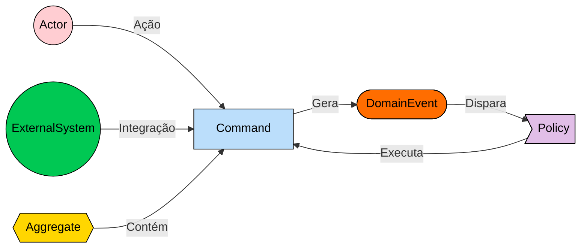

# Event Storming

## Legenda


```

## Diagrama Fluxo de Checkout da Loja Online

```mermaid
---
config:
  theme: redux
  layout: dagre
---
flowchart TD
    %% Actors
    customer(("Customer"))
    paymentGW(("PaymentGateway"))
    deliveryCompany(("DeliveryCompany"))
    
    %% Aggregates
    orderAgg{{"Order"}}
    paymentAgg{{"Payment"}}
    shippingAgg{{"Shipping"}}
    inventoryAgg{{"Inventory"}}
    invoiceAgg{{"Invoice"}}
    timeoutAgg{{"ReservationTimeout"}}
    
    %% Commands
    createOrder["CreateOrder"]
    createPayment["CreatePayment"]
    updateOrderStatus["UpdateOrderStatus"]
    cancelOrder["CancelOrder"]
    confirmPayment["ConfirmPayment"]
    rejectPayment["RejectPayment"]
    createShipment["CreateShipment"]
    processDeliveryNotification["ProcessDeliveryNotification"]
    reserveInventory["ReserveInventory"]
    deductInventory["DeductInventory"]
    expireInventoryReservation["ExpireInventoryReservation"]
    releaseInventory["ReleaseInventory"]
    createInvoice["CreateInvoice"]
    scheduleTimeout["ScheduleTimeout"]
    cancelTimeout["CancelTimeout"]
    callDeliveryAPI["CallDeliveryAPI"]
    callPaymentAPI["CallPaymentAPI"]
    processPaymentCallback["ProcessPaymentCallback"]
    
    %% Domain Events
    orderCreated(["OrderCreated"])
    orderUpdated(["OrderUpdated"])
    orderCancelled(["OrderCancelled"])
    paymentCreated(["PaymentCreated"])
    paymentProcessed(["PaymentProcessed"])
    paymentConfirmed(["PaymentConfirmed"])
    paymentFailed(["PaymentFailed"])
    shipmentCreated(["ShipmentCreated"])
    deliveryCompleted(["DeliveryCompleted"])
    inventoryReserved(["InventoryReserved"])
    inventoryDeducted(["InventoryDeducted"])
    inventoryReservationExpired(["InventoryReservationExpired"])
    inventoryReservationReleased(["InventoryReservationReleased"])
    invoiceCreated(["InvoiceCreated"])
    timeoutScheduled(["TimeoutScheduled"])
    timeoutExpired(["TimeoutExpired"])
    timeoutCancelled(["TimeoutCancelled"])
    
    %% Policies
    triggerReserveInventory>"TriggerReserveInventory"]
    handleReservationTimeout>"HandleReservationTimeout"]
    listenPaymentStatus>"ListenPaymentStatus"]
    checkPaymentResult>"CheckPaymentResult"]
    triggerInvoiceGeneration>"TriggerInvoiceGeneration"]
    triggerInventoryDeduction>"TriggerInventoryDeduction"]
    triggerShipmentCreation>"TriggerShipmentCreation"]
    handleDeliveryEvents>"HandleDeliveryEvents"]
    handlePaymentFailure>"HandlePaymentFailure"]
    handleInventoryReservationExpiry>"HandleInventoryReservationExpiry"]
    handleOrderCancellationOnReservationExpiry>"HandleOrderCancellationOnReservationExpiry"]
    ensureOrderConsistency>"EnsureOrderConsistency"]
    cancelTimeoutOnPayment>"CancelTimeoutOnPayment"]
    integrateWithDeliveryCompany>"IntegrateWithDeliveryCompany"]
    integrateWithPaymentGateway>"IntegrateWithPaymentGateway"]
    
    %% Main Flow - Happy Path
    customer --> createOrder
    createOrder --> orderAgg
    orderAgg --> orderCreated
    
    orderCreated --> triggerReserveInventory
    triggerReserveInventory --> reserveInventory
    reserveInventory --> inventoryAgg
    inventoryAgg --> inventoryReserved
    
    inventoryReserved --> handleReservationTimeout
    handleReservationTimeout --> scheduleTimeout
    scheduleTimeout --> timeoutAgg
    timeoutAgg --> timeoutScheduled
    
    customer --> createPayment
    createPayment --> paymentAgg
    paymentAgg --> paymentCreated
    
    paymentCreated --> integrateWithPaymentGateway
    integrateWithPaymentGateway --> callPaymentAPI
    callPaymentAPI --> paymentGW
    paymentGW --> processPaymentCallback
    
    processPaymentCallback --> paymentAgg
    paymentAgg --> paymentProcessed
    
    paymentProcessed --> checkPaymentResult
    checkPaymentResult --> confirmPayment
    checkPaymentResult --> rejectPayment
    
    confirmPayment --> paymentAgg
    paymentAgg --> paymentConfirmed
    
    %% Cancelar timeout quando pagamento confirmado
    paymentConfirmed --> cancelTimeoutOnPayment
    cancelTimeoutOnPayment --> cancelTimeout
    cancelTimeout --> timeoutAgg
    timeoutAgg --> timeoutCancelled
    
    paymentConfirmed --> triggerInvoiceGeneration
    triggerInvoiceGeneration --> createInvoice
    createInvoice --> invoiceAgg
    invoiceAgg --> invoiceCreated
    
    invoiceCreated --> triggerInventoryDeduction
    triggerInventoryDeduction --> deductInventory
    deductInventory --> inventoryAgg
    inventoryAgg --> inventoryDeducted
    
    inventoryDeducted --> triggerShipmentCreation
    triggerShipmentCreation --> createShipment
    createShipment --> shippingAgg
    shippingAgg --> shipmentCreated
    
    shipmentCreated --> integrateWithDeliveryCompany
    integrateWithDeliveryCompany --> callDeliveryAPI
    callDeliveryAPI --> deliveryCompany
    deliveryCompany --> processDeliveryNotification
    
    processDeliveryNotification --> shippingAgg
    shippingAgg --> deliveryCompleted
    
    shipmentCreated --> handleDeliveryEvents
    deliveryCompleted --> handleDeliveryEvents
    handleDeliveryEvents --> updateOrderStatus
    
    updateOrderStatus --> orderAgg
    orderAgg --> orderUpdated
    
    %% Error Handling & Compensations
    rejectPayment --> paymentAgg
    paymentAgg --> paymentFailed
    
    paymentFailed --> handlePaymentFailure
    handlePaymentFailure --> cancelOrder
    handlePaymentFailure --> releaseInventory
    
    %% Timeout expiry flow
    timeoutAgg --> timeoutExpired
    timeoutExpired --> handleInventoryReservationExpiry
    handleInventoryReservationExpiry --> expireInventoryReservation
    expireInventoryReservation --> inventoryAgg
    inventoryAgg --> inventoryReservationExpired
    
    inventoryReservationExpired --> handleOrderCancellationOnReservationExpiry
    handleOrderCancellationOnReservationExpiry --> cancelOrder
    
    cancelOrder --> orderAgg
    orderAgg --> orderCancelled
    
    %% Release inventory flow
    releaseInventory --> inventoryAgg
    inventoryAgg --> inventoryReservationReleased
    
    orderCancelled --> ensureOrderConsistency
    paymentFailed --> ensureOrderConsistency
    inventoryReservationReleased --> ensureOrderConsistency
    
    %% Payment Status Monitoring
    paymentConfirmed --> listenPaymentStatus
    paymentFailed --> listenPaymentStatus
    listenPaymentStatus --> updateOrderStatus
    
    %% Styling
    customer:::Actor
    paymentGW:::ExternalSystem
    deliveryCompany:::ExternalSystem
    
    orderAgg:::Aggregate
    paymentAgg:::Aggregate
    shippingAgg:::Aggregate
    inventoryAgg:::Aggregate
    invoiceAgg:::Aggregate
    timeoutAgg:::Aggregate
    
    createOrder:::Command
    createPayment:::Command
    updateOrderStatus:::Command
    cancelOrder:::Command
    confirmPayment:::Command
    rejectPayment:::Command
    createShipment:::Command
    processDeliveryNotification:::Command
    reserveInventory:::Command
    deductInventory:::Command
    expireInventoryReservation:::Command
    releaseInventory:::Command
    createInvoice:::Command
    scheduleTimeout:::Command
    cancelTimeout:::Command
    callDeliveryAPI:::Command
    callPaymentAPI:::Command
    processPaymentCallback:::Command
    
    orderCreated:::DomainEvent
    orderUpdated:::DomainEvent
    orderCancelled:::DomainEvent
    paymentCreated:::DomainEvent
    paymentProcessed:::DomainEvent
    paymentConfirmed:::DomainEvent
    paymentFailed:::DomainEvent
    shipmentCreated:::DomainEvent
    deliveryCompleted:::DomainEvent
    inventoryReserved:::DomainEvent
    inventoryDeducted:::DomainEvent
    inventoryReservationExpired:::DomainEvent
    inventoryReservationReleased:::DomainEvent
    invoiceCreated:::DomainEvent
    timeoutScheduled:::DomainEvent
    timeoutExpired:::DomainEvent
    timeoutCancelled:::DomainEvent
    
    triggerReserveInventory:::Policy
    handleReservationTimeout:::Policy
    listenPaymentStatus:::Policy
    checkPaymentResult:::Policy
    triggerInvoiceGeneration:::Policy
    triggerInventoryDeduction:::Policy
    triggerShipmentCreation:::Policy
    handleDeliveryEvents:::Policy
    handlePaymentFailure:::Policy
    handleInventoryReservationExpiry:::Policy
    handleOrderCancellationOnReservationExpiry:::Policy
    ensureOrderConsistency:::Policy
    cancelTimeoutOnPayment:::Policy
    integrateWithDeliveryCompany:::Policy
    integrateWithPaymentGateway:::Policy
    
    classDef Actor stroke:#000000, fill:#FFCDD2, color:#000000
    classDef ExternalSystem stroke:#000000, fill:#00C853, color:#000000
    classDef Aggregate stroke-width:1px, stroke-dasharray: 0, stroke:#000000, fill:#FFD600, color:#000000
    classDef Command stroke:#000000, fill:#BBDEFB, color:#000000
    classDef DomainEvent stroke:#000000, fill:#FF6D00, color:#000000
    classDef Policy fill:#E1BEE7, stroke:#000000, color:#000000
```




## Actors


### Customer
- **Tipo:** Humano
- **Descrição:** Cliente da loja Bazarium que realiza pedidos e pagamentos.
- **Principais Interações:** CreateOrder, CreatePayment

### PaymentGateway
- **Tipo:** Sistema Externo
- **Descrição:** Gateway de pagamento externo (ex: Stripe, PayPal) responsável pelo processamento de transações financeiras.
- **Principais Interações:** Recebe CallPaymentAPI, retorna callback via ProcessPaymentCallback

### DeliveryCompany
- **Tipo:** Sistema Externo
- **Descrição:** Empresa de logística terceirizada responsável pela coleta e entrega dos produtos.
- **Principais Interações:** Recebe CallDeliveryAPI, notifica status via ProcessDeliveryNotification

## Aggregates


### Order
- **Descrição:** Representa o pedido realizado pelo cliente, controlando todo o ciclo de vida desde criação até finalização.
- **Entidades e Objetos de Valor:** OrderItem, CustomerInfo, OrderStatus, OrderId
- **Comandos Manipulados:** CreateOrder, UpdateOrderStatus, CancelOrder
- **Eventos Gerados:** OrderCreated, OrderUpdated, OrderCancelled
- **Estados Possíveis:** Created, InventoryReserved, PaymentPending, PaymentConfirmed, InvoiceGenerated, InventoryDeducted, ShippingRequested, InTransit, Delivered, Completed, Cancelled
- **Regras de Negócio:** 
  - Validação de itens e quantidades
  - Controle de transições de estado
  - Verificação de elegibilidade para cancelamento
  - Manutenção de histórico de mudanças

### Payment
- **Descrição:** Gerencia o processo de pagamento de um pedido, incluindo integração com gateways externos.
- **Entidades e Objetos de Valor:** PaymentDetails, PaymentMethod, PaymentStatus, TransactionId
- **Comandos Manipulados:** CreatePayment, ProcessPaymentCallback, ConfirmPayment, RejectPayment
- **Eventos Gerados:** PaymentCreated, PaymentProcessed, PaymentConfirmed, PaymentFailed
- **Estados Possíveis:** Created, Processing, Confirmed, Failed, TimedOut
- **Regras de Negócio:** 
  - Validação de dados de pagamento
  - Controle de timeout de transações
  - Verificação de integridade com callbacks
  - Prevenção de double processing

### Shipping
- **Descrição:** Gerencia o processo de entrega do pedido através de integração com transportadoras.
- **Entidades e Objetos de Valor:** ShippingAddress, TrackingCode, DeliveryStatus, ShipmentDetails
- **Comandos Manipulados:** CreateShipment, ProcessDeliveryNotification
- **Eventos Gerados:** ShipmentCreated, DeliveryCompleted
- **Estados Possíveis:** Created, PickupRequested, InTransit, OutForDelivery, Delivered, Failed
- **Regras de Negócio:** 
  - Validação de endereço de entrega
  - Integração com múltiplas transportadoras
  - Tratamento de falhas de entrega
  - Rastreamento de status

### Inventory
- **Descrição:** Gerencia o estoque dos produtos, incluindo reservas temporárias e deduções definitivas.
- **Entidades e Objetos de Valor:** InventoryItem, ProductId, QuantityAvailable, QuantityReserved
- **Comandos Manipulados:** ReserveInventory, DeductInventory, ExpireInventoryReservation, ReleaseInventory
- **Eventos Gerados:** InventoryReserved, InventoryDeducted, InventoryReservationExpired, InventoryReservationReleased
- **Regras de Negócio:** 
  - Controle de concorrência para reservas
  - Prevenção de overselling
  - Gestão de timeouts de reserva
  - Auditoria de movimentações

### Invoice
- **Descrição:** Representa a fatura fiscal gerada após confirmação do pagamento.
- **Entidades e Objetos de Valor:** InvoiceDetails, TaxInformation, InvoiceNumber, IssueDate
- **Comandos Manipulados:** CreateInvoice
- **Eventos Gerados:** InvoiceCreated
- **Regras de Negócio:** 
  - Geração automática após pagamento confirmado
  - Conformidade com regulamentações fiscais
  - Numeração sequencial obrigatória
  - Informações tributárias corretas

### ReservationTimeout
- **Descrição:** Gerencia timeouts de reservas de estoque para evitar bloqueios indefinidos.
- **Entidades e Objetos de Valor:** TimeoutSchedule, ReservationId, ExpirationTime
- **Comandos Manipulados:** ScheduleTimeout, CancelTimeout
- **Eventos Gerados:** TimeoutScheduled, TimeoutExpired, TimeoutCancelled
- **Regras de Negócio:** 
  - Timeout padrão de 15 minutos para reservas
  - Cancelamento automático quando pagamento confirmado
  - Limpeza de timeouts expirados

## Commands


### CreateOrder
- **Descrição:** Cria um novo pedido para o cliente com validação de produtos e quantidades.
- **Agregado Alvo:** Order
- **Atores Possíveis:** Customer
- **Eventos Resultantes:** OrderCreated
- **Validações/Regras:** Produtos existem no catálogo, quantidades válidas, dados do cliente completos

### CreatePayment
- **Descrição:** Inicia o processo de pagamento de um pedido específico.
- **Agregado Alvo:** Payment
- **Atores Possíveis:** Customer
- **Eventos Resultantes:** PaymentCreated
- **Validações/Regras:** Pedido válido e não pago, método de pagamento aceito, valor correto

### CreateShipment
- **Descrição:** Cria um shipment solicitando coleta à transportadora.
- **Agregado Alvo:** Shipping
- **Atores Possíveis:** Sistema (Policy)
- **Eventos Resultantes:** ShipmentCreated
- **Validações/Regras:** Estoque deduzido, fatura gerada, endereço válido

### DeductInventory
- **Descrição:** Deduz estoque definitivamente após confirmação de pagamento.
- **Agregado Alvo:** Inventory
- **Atores Possíveis:** Sistema (Policy)
- **Eventos Resultantes:** InventoryDeducted
- **Validações/Regras:** Estoque reservado existe, fatura gerada

### UpdateOrderStatus
- **Descrição:** Atualiza o status do pedido conforme evolução do processo.
- **Agregado Alvo:** Order
- **Atores Possíveis:** Sistema (Policy)
- **Eventos Resultantes:** OrderUpdated
- **Validações/Regras:** Transição de status válida, pedido existe

### ReserveInventory
- **Descrição:** Reserva estoque temporariamente para um pedido.
- **Agregado Alvo:** Inventory
- **Atores Possíveis:** Sistema (Policy)
- **Eventos Resultantes:** InventoryReserved
- **Validações/Regras:** Estoque disponível suficiente, produtos válidos

### ProcessPaymentCallback
- **Descrição:** Processa callback de pagamento recebido do gateway.
- **Agregado Alvo:** Payment
- **Atores Possíveis:** Sistema (Webhook Handler)
- **Eventos Resultantes:** PaymentProcessed
- **Validações/Regras:** Callback autêntico, formato válido, pagamento em andamento

### ConfirmPayment
- **Descrição:** Confirma o pagamento como bem-sucedido após validação do gateway.
- **Agregado Alvo:** Payment
- **Atores Possíveis:** Sistema (Policy)
- **Eventos Resultantes:** PaymentConfirmed
- **Validações/Regras:** Pagamento foi processado com sucesso pelo gateway

### RejectPayment
- **Descrição:** Rejeita o pagamento após falha detectada pelo gateway.
- **Agregado Alvo:** Payment
- **Atores Possíveis:** Sistema (Policy)
- **Eventos Resultantes:** PaymentFailed
- **Validações/Regras:** Pagamento foi processado e resultado indicou falha

### ProcessDeliveryNotification
- **Descrição:** Processa notificação de status de entrega da transportadora.
- **Agregado Alvo:** Shipping
- **Atores Possíveis:** Sistema (Webhook Handler)
- **Eventos Resultantes:** DeliveryCompleted
- **Validações/Regras:** Notificação autêntica, formato válido, shipment existe

### ExpireInventoryReservation
- **Descrição:** Expira uma reserva de estoque não utilizada.
- **Agregado Alvo:** Inventory
- **Atores Possíveis:** Sistema (Policy)
- **Eventos Resultantes:** InventoryReservationExpired
- **Validações/Regras:** Timeout expirou, reserva ainda ativa

### ReleaseInventory
- **Descrição:** Libera uma reserva de estoque manualmente.
- **Agregado Alvo:** Inventory
- **Atores Possíveis:** Sistema (Policy)
- **Eventos Resultantes:** InventoryReservationReleased
- **Validações/Regras:** Reserva existe e está ativa

### CancelOrder
- **Descrição:** Cancela o pedido do cliente por solicitação ou falha no processo.
- **Agregado Alvo:** Order
- **Atores Possíveis:** Customer, Sistema (Policy)
- **Eventos Resultantes:** OrderCancelled
- **Validações/Regras:** Pedido pode ser cancelado, não está em processamento de entrega

### CreateInvoice
- **Descrição:** Gera a fatura fiscal do pedido.
- **Agregado Alvo:** Invoice
- **Atores Possíveis:** Sistema (Policy)
- **Eventos Resultantes:** InvoiceCreated
- **Validações/Regras:** Pagamento confirmado, dados fiscais válidos

### ScheduleTimeout
- **Descrição:** Agenda o timeout de uma reserva de estoque.
- **Agregado Alvo:** ReservationTimeout
- **Atores Possíveis:** Sistema (Policy)
- **Eventos Resultantes:** TimeoutScheduled
- **Validações/Regras:** Reserva ativa, timeout não existe

### CancelTimeout
- **Descrição:** Cancela um timeout agendado.
- **Agregado Alvo:** ReservationTimeout
- **Atores Possíveis:** Sistema (Policy)
- **Eventos Resultantes:** TimeoutCancelled
- **Validações/Regras:** Timeout existe e não expirou

### CallDeliveryAPI
- **Descrição:** Integração externa - solicita coleta à transportadora.
- **Agregado Alvo:** Nenhum (Comando de Integração)
- **Atores Possíveis:** Sistema (Policy)
- **Eventos Resultantes:** Nenhum direto (resposta via ProcessDeliveryNotification)
- **Validações/Regras:** Dados do shipment válidos, API disponível

### CallPaymentAPI
- **Descrição:** Integração externa - processa pagamento no gateway.
- **Agregado Alvo:** Nenhum (Comando de Integração)
- **Atores Possíveis:** Sistema (Policy)
- **Eventos Resultantes:** Nenhum direto (resposta via ProcessPaymentCallback)
- **Validações/Regras:** Dados de pagamento válidos, gateway disponível

### ProcessPaymentCallback
- **Descrição:** Processa callback de pagamento recebido do gateway.
- **Agregado Alvo:** Payment
- **Atores Possíveis:** Sistema (Webhook Handler)
- **Eventos Resultantes:** PaymentProcessed
- **Validações/Regras:** Callback autêntico, formato válido, transação existe
## Domain Events


### OrderCreated
- **Descrição:** Um novo pedido foi criado no sistema.
- **Agregado de Origem:** Order
- **Consequências:** Dispara reserva de estoque
- **Importância para o Negócio:** Inicia todo o fluxo de processamento de pedido

### OrderUpdated
- **Descrição:** O status ou informações do pedido foram atualizados.
- **Agregado de Origem:** Order
- **Consequências:** Notificação ao cliente, atualização de dashboards
- **Importância para o Negócio:** Transparência e rastreabilidade do processo

### OrderCancelled
- **Descrição:** Um pedido foi cancelado pelo cliente ou sistema.
- **Agregado de Origem:** Order
- **Consequências:** Liberação de reservas, compensações necessárias
- **Importância para o Negócio:** Controle de fluxo, otimização de recursos

### PaymentCreated
- **Descrição:** O processo de pagamento foi iniciado.
- **Agregado de Origem:** Payment
- **Consequências:** Integração com gateway de pagamento
- **Importância para o Negócio:** Início da transação financeira

### PaymentProcessed
- **Descrição:** O pagamento foi processado pelo gateway (sucesso ou falha).
- **Agregado de Origem:** Payment
- **Consequências:** Decisão de confirmar ou rejeitar pagamento
- **Importância para o Negócio:** Resultado da transação financeira

### PaymentConfirmed
- **Descrição:** O pagamento foi confirmado com sucesso.
- **Agregado de Origem:** Payment
- **Consequências:** Geração de fatura, dedução de estoque, cancelamento de timeout
- **Importância para o Negócio:** Libera o pedido para fulfillment

### PaymentFailed
- **Descrição:** O pagamento falhou durante o processamento.
- **Agregado de Origem:** Payment
- **Consequências:** Cancelamento do pedido, liberação de reservas
- **Importância para o Negócio:** Prevenção de processos sem pagamento

### ShipmentCreated
- **Descrição:** Um shipment foi criado e entrega solicitada.
- **Agregado de Origem:** Shipping
- **Consequências:** Integração com transportadora, monitoramento de entrega
- **Importância para o Negócio:** Início do processo logístico

### DeliveryCompleted
- **Descrição:** A entrega foi concluída com sucesso.
- **Agregado de Origem:** Shipping
- **Consequências:** Finalização do pedido, atualização de status
- **Importância para o Negócio:** Conclusão da experiência do cliente

### InventoryReserved
- **Descrição:** Estoque foi reservado temporariamente para o pedido.
- **Agregado de Origem:** Inventory
- **Consequências:** Agendamento de timeout, proteção contra overselling
- **Importância para o Negócio:** Garante disponibilidade durante pagamento

### InventoryDeducted
- **Descrição:** Estoque foi deduzido definitivamente.
- **Agregado de Origem:** Inventory
- **Consequências:** Criação de shipment, atualização de disponibilidade
- **Importância para o Negócio:** Confirmação da separação física

### InventoryReservationExpired
- **Descrição:** Uma reserva de estoque expirou por timeout.
- **Agregado de Origem:** Inventory
- **Consequências:** Cancelamento automático do pedido
- **Importância para o Negócio:** Liberação de recursos não utilizados

### InventoryReservationReleased
- **Descrição:** Uma reserva de estoque foi liberada.
- **Agregado de Origem:** Inventory
- **Consequências:** Disponibilização para outros pedidos
- **Importância para o Negócio:** Otimização do uso de estoque

### InvoiceCreated
- **Descrição:** A fatura fiscal foi gerada.
- **Agregado de Origem:** Invoice
- **Consequências:** Dedução de estoque, envio ao cliente
- **Importância para o Negócio:** Cumprimento de obrigações fiscais

### TimeoutScheduled
- **Descrição:** Um timeout de reserva foi agendado.
- **Agregado de Origem:** ReservationTimeout
- **Consequências:** Monitoramento automático de prazo
- **Importância para o Negócio:** Prevenção de bloqueios indefinidos

### TimeoutExpired
- **Descrição:** Um timeout de reserva expirou.
- **Agregado de Origem:** ReservationTimeout
- **Consequências:** Expiração da reserva correspondente
- **Importância para o Negócio:** Liberação automática de recursos

### TimeoutCancelled
- **Descrição:** Um timeout foi cancelado antes de expirar.
- **Agregado de Origem:** ReservationTimeout
- **Consequências:** Manutenção da reserva ativa
- **Importância para o Negócio:** Controle de fluxo adequado

## Policies


### TriggerReserveInventory
- **Descrição:** Reserva estoque automaticamente após criação do pedido.
- **Evento(s) de Disparo:** OrderCreated
- **Ações Executadas:** ReserveInventory
- **Regras de Negócio:** Verificar disponibilidade antes de reservar

### HandleReservationTimeout
- **Descrição:** Agenda timeout para reservas de estoque.
- **Evento(s) de Disparo:** InventoryReserved
- **Ações Executadas:** ScheduleTimeout
- **Regras de Negócio:** Timeout padrão de 15 minutos

### IntegrateWithPaymentGateway
- **Descrição:** Integra com gateway após criação de pagamento.
- **Evento(s) de Disparo:** PaymentCreated
- **Ações Executadas:** CallPaymentAPI
- **Regras de Negócio:** Anti-corruption layer para integração externa

### CheckPaymentResult
- **Descrição:** Avalia resultado do processamento no gateway.
- **Evento(s) de Disparo:** PaymentProcessed
- **Ações Executadas:** ConfirmPayment ou RejectPayment
- **Regras de Negócio:** Decisão baseada no status retornado pelo gateway

### CancelTimeoutOnPayment
- **Descrição:** Cancela timeout quando pagamento é confirmado.
- **Evento(s) de Disparo:** PaymentConfirmed
- **Ações Executadas:** CancelTimeout
- **Regras de Negócio:** Evitar cancelamento após pagamento bem-sucedido

### TriggerInvoiceGeneration
- **Descrição:** Gera fatura após confirmação de pagamento.
- **Evento(s) de Disparo:** PaymentConfirmed
- **Ações Executadas:** CreateInvoice
- **Regras de Negócio:** Obrigatório para cumprimento fiscal

### TriggerInventoryDeduction
- **Descrição:** Deduz estoque após geração da fatura.
- **Evento(s) de Disparo:** InvoiceCreated
- **Ações Executadas:** DeductInventory
- **Regras de Negócio:** Confirmação financeira antes da dedução física

### TriggerShipmentCreation
- **Descrição:** Cria shipment após dedução de estoque.
- **Evento(s) de Disparo:** InventoryDeducted
- **Ações Executadas:** CreateShipment
- **Regras de Negócio:** Produtos separados fisicamente

### IntegrateWithDeliveryCompany
- **Descrição:** Solicita coleta à transportadora.
- **Evento(s) de Disparo:** ShipmentCreated
- **Ações Executadas:** CallDeliveryAPI
- **Regras de Negócio:** Anti-corruption layer para integração externa

### HandleDeliveryEvents
- **Descrição:** Processa eventos de entrega para atualizar pedido.
- **Evento(s) de Disparo:** ShipmentCreated, DeliveryCompleted
- **Ações Executadas:** UpdateOrderStatus
- **Regras de Negócio:** Manter sincronização entre shipping e order

### HandlePaymentFailure
- **Descrição:** Compensa falhas de pagamento.
- **Evento(s) de Disparo:** PaymentFailed
- **Ações Executadas:** CancelOrder, ReleaseInventory
- **Regras de Negócio:** Limpeza completa de recursos alocados

### HandleInventoryReservationExpiry
- **Descrição:** Processa expiração de reservas.
- **Evento(s) de Disparo:** TimeoutExpired
- **Ações Executadas:** ExpireInventoryReservation
- **Regras de Negócio:** Liberação automática após timeout

### HandleOrderCancellationOnReservationExpiry
- **Descrição:** Cancela pedido quando reserva expira.
- **Evento(s) de Disparo:** InventoryReservationExpired
- **Ações Executadas:** CancelOrder
- **Regras de Negócio:** Manter consistência entre inventory e order

### EnsureOrderConsistency
- **Descrição:** Garante consistência após cancelamentos.
- **Evento(s) de Disparo:** OrderCancelled, PaymentFailed, InventoryReservationReleased
- **Ações Executadas:** Limpeza de recursos, notificações
- **Regras de Negócio:** Estado final consistente

### ListenPaymentStatus
- **Descrição:** Monitora status de pagamento para atualizar pedido.
- **Evento(s) de Disparo:** PaymentConfirmed, PaymentFailed
- **Ações Executadas:** UpdateOrderStatus
- **Regras de Negócio:** Sincronização entre payment e order

## Fluxos Principais

### Happy Path - Processamento Completo
1. **Customer** → CreateOrder → **OrderCreated**
2. **OrderCreated** → TriggerReserveInventory → ReserveInventory → **InventoryReserved**
3. **InventoryReserved** → HandleReservationTimeout → ScheduleTimeout → **TimeoutScheduled**
4. **Customer** → CreatePayment → **PaymentCreated**
5. **PaymentCreated** → IntegrateWithPaymentGateway → CallPaymentAPI → **PaymentGateway**
6. **PaymentGateway** → ProcessPaymentCallback → **PaymentProcessed**
7. **PaymentProcessed** → CheckPaymentResult → ConfirmPayment → **PaymentConfirmed**
8. **PaymentConfirmed** → CancelTimeoutOnPayment → CancelTimeout → **TimeoutCancelled**
9. **PaymentConfirmed** → TriggerInvoiceGeneration → CreateInvoice → **InvoiceCreated**
10. **InvoiceCreated** → TriggerInventoryDeduction → DeductInventory → **InventoryDeducted**
11. **InventoryDeducted** → TriggerShipmentCreation → CreateShipment → **ShipmentCreated**
12. **ShipmentCreated** → IntegrateWithDeliveryCompany → CallDeliveryAPI → **DeliveryCompany**
13. **DeliveryCompany** → ProcessDeliveryNotification → **DeliveryCompleted**
14. **DeliveryCompleted** → HandleDeliveryEvents → UpdateOrderStatus → **OrderUpdated**

### Compensation Flows

#### Falha de Pagamento
1. **PaymentProcessed** → CheckPaymentResult → RejectPayment → **PaymentFailed**
2. **PaymentFailed** → HandlePaymentFailure → [CancelOrder, ReleaseInventory]
3. **CancelOrder** → **OrderCancelled**
4. **ReleaseInventory** → **InventoryReservationReleased**

#### Timeout de Reserva
1. **TimeoutExpired** → HandleInventoryReservationExpiry → ExpireInventoryReservation → **InventoryReservationExpired**
2. **InventoryReservationExpired** → HandleOrderCancellationOnReservationExpiry → CancelOrder → **OrderCancelled**

## Integrações Externas

### Payment Gateway Integration
- **Padrão:** Request-Response + Webhook Callback
- **Fluxo:** CallPaymentAPI → Gateway Processing → ProcessPaymentCallback
- **Timeouts:** 30 segundos para response, 5 minutos para callback
- **Retry:** Exponential backoff até 3 tentativas
- **Anti-Corruption Layer:** IntegrateWithPaymentGateway policy

### Delivery Company Integration  
- **Padrão:** Request-Response + Webhook Notification
- **Fluxo:** CallDeliveryAPI → Pickup Request → ProcessDeliveryNotification
- **Timeouts:** 60 segundos para response, notificações assíncronas
- **Retry:** Circuit breaker com fallback para API alternativa
- **Anti-Corruption Layer:** IntegrateWithDeliveryCompany policy

## Considerações de Implementação

### Patterns Aplicados
- **Choreography Saga:** Coordenação distribuída via eventos
- **Anti-Corruption Layer:** Integração com sistemas externos
- **Timeout Pattern:** Gestão automática de recursos (15 minutos para reservas)
- **Compensation Pattern:** Reversão de operações em caso de falha

### Resiliência
- **Timeouts:** 15 minutos para reservas de estoque
- **Retries:** Exponential backoff para integrações externas
- **Circuit Breakers:** Proteção contra falhas de sistemas externos
- **Dead Letter Queues:** Tratamento de eventos não processáveis

### Monitoramento e Métricas

#### KPIs por Agregado
- **Order:** Taxa de conversão, tempo médio de processamento, taxa de cancelamento
- **Payment:** Taxa de aprovação, tempo médio de confirmação, taxa de timeout
- **Inventory:** Taxa de reserva vs. dedução, tempo médio de reserva
- **Shipping:** Tempo médio de entrega, taxa de entrega bem-sucedida

#### Alertas Críticos
- TimeoutExpired > 5% dos pedidos em 1 hora
- PaymentFailed > 10% em 15 minutos  
- DeliveryAPI não responsivo > 2 minutos
- InventoryReservation > 90% da capacidade

## Saga Patterns Recomendados

### OrderProcessingSaga
**Orquestra o fluxo completo de processamento do pedido conforme modelo do diagrama:**
1. OrderCreated → ReserveInventory
2. InventoryReserved → ScheduleTimeout + CreatePayment (iniciativa do cliente)
3. PaymentCreated → CallPaymentAPI
4. PaymentProcessed → ConfirmPayment/RejectPayment
5. PaymentConfirmed → CancelTimeout + CreateInvoice
6. InvoiceCreated → DeductInventory
7. InventoryDeducted → CreateShipment
8. ShipmentCreated → CallDeliveryAPI
9. DeliveryCompleted → UpdateOrderStatus

**Compensações Baseadas no Diagrama:**
- PaymentFailed → [CancelOrder + ReleaseInventory] → EnsureOrderConsistency
- TimeoutExpired → ExpireInventoryReservation → [CancelOrder] → EnsureOrderConsistency
- InventoryReservationReleased → EnsureOrderConsistency

**Sincronização de Status:**
- PaymentConfirmed/PaymentFailed → ListenPaymentStatus → UpdateOrderStatus
- ShipmentCreated/DeliveryCompleted → HandleDeliveryEvents → UpdateOrderStatus

