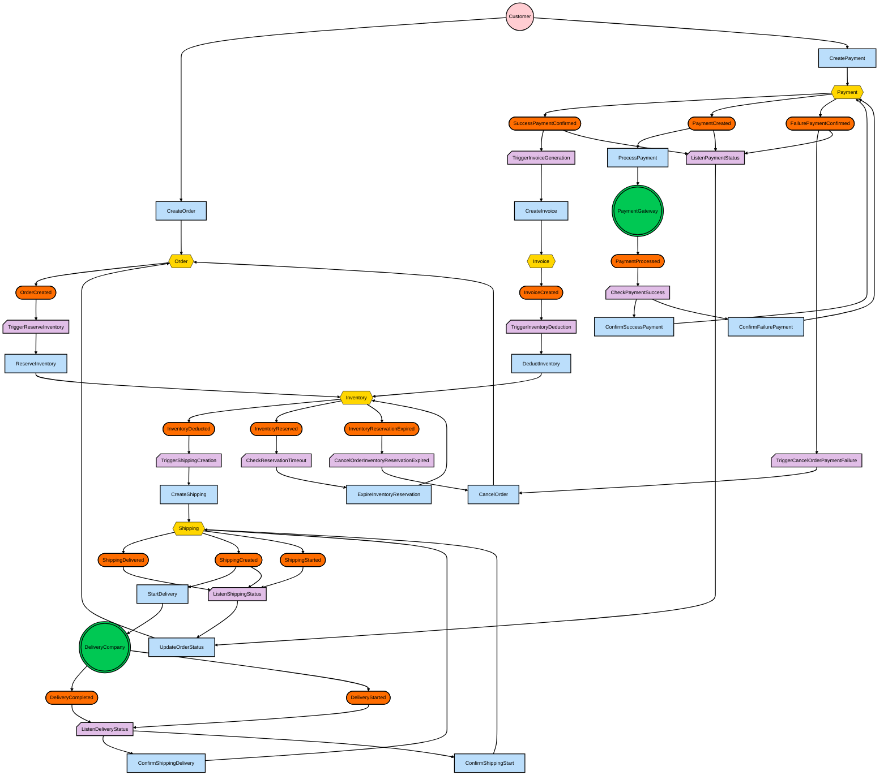

# Event Storming

## Diagrama

## Actors

### Customer
- **Tipo:** Humano
- **Descrição:** Usuário da loja que realiza pedidos e pagamentos.
- **Principais Interações:** CreateOrder, CreatePayment

### PaymentGateway
- **Tipo:** Sistema Externo
- **Descrição:** Sistema de terceiros responsável pelo processamento de pagamentos.
- **Principais Interações:** Recebe ProcessPayment, retorna PaymentProcessed

### DeliveryCompany
- **Tipo:** Sistema Externo
- **Descrição:** Empresa responsável pela entrega dos pedidos.
- **Principais Interações:** Recebe StartDelivery, retorna DeliveryCompleted

## Aggregates

### Order
- **Descrição:** Representa o pedido realizado pelo cliente.
- **Entidades e Objetos de Valor:** OrderItem, CustomerInfo
- **Comandos Manipulados:** CreateOrder, UpdateOrderStatus, CancelOrder
- **Eventos Gerados:** OrderCreated
- **Regras de Negócio:** Validação de itens, status do pedido

### Payment
- **Descrição:** Gerencia o pagamento de um pedido.
- **Entidades e Objetos de Valor:** PaymentDetails
- **Comandos Manipulados:** CreatePayment, ConfirmSuccessPayment, ConfirmFailurePayment
- **Eventos Gerados:** PaymentCreated, SuccessPaymentConfirmed, FailurePaymentConfirmed
- **Regras de Negócio:** Validação de status de pagamento

### Shipping
- **Descrição:** Gerencia o processo de entrega do pedido.
- **Entidades e Objetos de Valor:** ShippingAddress
- **Comandos Manipulados:** CreateShipping, ConfirmShippingDelivery, StartDelivery, ConfirmShippingStart
- **Eventos Gerados:** ShippingCreated, ShippingDelivered, ShippingStarted, DeliveryCompleted, DeliveryStarted
- **Regras de Negócio:** Controle de status de entrega

### Inventory
- **Descrição:** Gerencia o estoque dos produtos.
- **Entidades e Objetos de Valor:** InventoryItem
- **Comandos Manipulados:** DeductInventory, ReserveInventory, ExpireInventoryReservation
- **Eventos Gerados:** InventoryDeducted, InventoryReserved, InventoryReservationExpired
- **Regras de Negócio:** Reserva e dedução de estoque

### Invoice
- **Descrição:** Representa a fatura gerada após o pagamento.
- **Entidades e Objetos de Valor:** InvoiceDetails
- **Comandos Manipulados:** CreateInvoice
- **Eventos Gerados:** InvoiceCreated
- **Regras de Negócio:** Geração de fatura após pagamento confirmado

## Commands

### CreateOrder
- **Descrição:** Cria um novo pedido para o cliente.
- **Agregado Alvo:** Order
- **Atores Possíveis:** Customer
- **Eventos Resultantes:** OrderCreated
- **Validações/Regras:** Itens válidos, estoque disponível

### CreatePayment
- **Descrição:** Inicia o processo de pagamento de um pedido.
- **Agregado Alvo:** Payment
- **Atores Possíveis:** Customer
- **Eventos Resultantes:** PaymentCreated
- **Validações/Regras:** Pedido existente, valor correto

### CreateShipping
- **Descrição:** Inicia o processo de entrega do pedido.
- **Agregado Alvo:** Shipping
- **Atores Possíveis:** Sistema (Policy)
- **Eventos Resultantes:** ShippingCreated
- **Validações/Regras:** Pedido pago

### DeductInventory
- **Descrição:** Deduz o estoque dos itens do pedido.
- **Agregado Alvo:** Inventory
- **Atores Possíveis:** Sistema (Policy)
- **Eventos Resultantes:** InventoryDeducted
- **Validações/Regras:** Estoque suficiente

### UpdateOrderStatus
- **Descrição:** Atualiza o status do pedido.
- **Agregado Alvo:** Order
- **Atores Possíveis:** Sistema (Policy)
- **Eventos Resultantes:** -
- **Validações/Regras:** Status permitido

### ReserveInventory
- **Descrição:** Reserva o estoque para um pedido.
- **Agregado Alvo:** Inventory
- **Atores Possíveis:** Sistema (Policy)
- **Eventos Resultantes:** InventoryReserved
- **Validações/Regras:** Estoque disponível

### ProcessPayment
- **Descrição:** Processa o pagamento via gateway externo.
- **Agregado Alvo:** Payment
- **Atores Possíveis:** Sistema (Policy)
- **Eventos Resultantes:** PaymentProcessed
- **Validações/Regras:** Dados válidos

### ConfirmSuccessPayment
- **Descrição:** Confirma o pagamento bem-sucedido.
- **Agregado Alvo:** Payment
- **Atores Possíveis:** Sistema (Policy)
- **Eventos Resultantes:** SuccessPaymentConfirmed
- **Validações/Regras:** Pagamento processado

### StartDelivery
- **Descrição:** Inicia a entrega do pedido.
- **Agregado Alvo:** Shipping
- **Atores Possíveis:** Sistema (Policy)
- **Eventos Resultantes:** DeliveryStarted
- **Validações/Regras:** Pedido pronto para envio

### ConfirmShippingDelivery
- **Descrição:** Confirma a entrega do pedido ao cliente.
- **Agregado Alvo:** Shipping
- **Atores Possíveis:** Sistema (Policy)
- **Eventos Resultantes:** ShippingDelivered
- **Validações/Regras:** Entrega realizada

### ExpireInventoryReservation
- **Descrição:** Expira a reserva de estoque não utilizada.
- **Agregado Alvo:** Inventory
- **Atores Possíveis:** Sistema (Policy)
- **Eventos Resultantes:** InventoryReservationExpired
- **Validações/Regras:** Tempo de reserva expirado

### CancelOrder
- **Descrição:** Cancela o pedido do cliente.
- **Agregado Alvo:** Order
- **Atores Possíveis:** Customer, Sistema (Policy)
- **Eventos Resultantes:** -
- **Validações/Regras:** Pedido pode ser cancelado

### CreateInvoice
- **Descrição:** Gera a fatura do pedido.
- **Agregado Alvo:** Invoice
- **Atores Possíveis:** Sistema (Policy)
- **Eventos Resultantes:** InvoiceCreated
- **Validações/Regras:** Pagamento confirmado

### ConfirmFailurePayment
- **Descrição:** Confirma o insucesso do pagamento.
- **Agregado Alvo:** Payment
- **Atores Possíveis:** Sistema (Policy)
- **Eventos Resultantes:** FailurePaymentConfirmed
- **Validações/Regras:** Pagamento processado

### ConfirmShippingStart
- **Descrição:** Confirma o início da entrega.
- **Agregado Alvo:** Shipping
- **Atores Possíveis:** Sistema (Policy)
- **Eventos Resultantes:** ShippingStarted
- **Validações/Regras:** Entrega iniciada

## Domain Events

### OrderCreated
- **Descrição:** Um novo pedido foi criado.
- **Agregado de Origem:** Order
- **Consequências:** Reserva de estoque, início do pagamento
- **Importância para o Negócio:** Inicia o fluxo de compra

### SuccessPaymentConfirmed
- **Descrição:** O pagamento foi confirmado com sucesso.
- **Agregado de Origem:** Payment
- **Consequências:** Geração de fatura, início do envio
- **Importância para o Negócio:** Permite liberar o pedido

### PaymentCreated
- **Descrição:** O pagamento foi iniciado.
- **Agregado de Origem:** Payment
- **Consequências:** Processamento do pagamento
- **Importância para o Negócio:** Inicia a transação financeira

### FailurePaymentConfirmed
- **Descrição:** O pagamento falhou.
- **Agregado de Origem:** Payment
- **Consequências:** Cancelamento do pedido
- **Importância para o Negócio:** Garante consistência financeira

### ShippingDelivered
- **Descrição:** O pedido foi entregue ao cliente.
- **Agregado de Origem:** Shipping
- **Consequências:** Finaliza o fluxo de entrega
- **Importância para o Negócio:** Satisfação do cliente

### ShippingCreated
- **Descrição:** O envio foi criado.
- **Agregado de Origem:** Shipping
- **Consequências:** Início da entrega
- **Importância para o Negócio:** Logística

### ShippingStarted
- **Descrição:** A entrega foi iniciada.
- **Agregado de Origem:** Shipping
- **Consequências:** Monitoramento da entrega
- **Importância para o Negócio:** Controle logístico

### InventoryDeducted
- **Descrição:** O estoque foi deduzido.
- **Agregado de Origem:** Inventory
- **Consequências:** Atualização de estoque
- **Importância para o Negócio:** Controle de inventário

### InventoryReserved
- **Descrição:** O estoque foi reservado para o pedido.
- **Agregado de Origem:** Inventory
- **Consequências:** Garante disponibilidade
- **Importância para o Negócio:** Evita overbooking

### InventoryReservationExpired
- **Descrição:** A reserva de estoque expirou.
- **Agregado de Origem:** Inventory
- **Consequências:** Liberação de estoque
- **Importância para o Negócio:** Otimização de inventário

### PaymentProcessed
- **Descrição:** O pagamento foi processado pelo gateway.
- **Agregado de Origem:** Payment
- **Consequências:** Confirmação de sucesso ou falha
- **Importância para o Negócio:** Integração financeira

### DeliveryCompleted
- **Descrição:** A entrega foi concluída.
- **Agregado de Origem:** Shipping
- **Consequências:** Finalização do pedido
- **Importância para o Negócio:** Satisfação do cliente

### DeliveryStarted
- **Descrição:** A entrega foi iniciada pela transportadora.
- **Agregado de Origem:** Shipping
- **Consequências:** Rastreamento
- **Importância para o Negócio:** Logística

### InvoiceCreated
- **Descrição:** A fatura foi gerada.
- **Agregado de Origem:** Invoice
- **Consequências:** Envio ao cliente
- **Importância para o Negócio:** Obrigações fiscais

## Policies

### ListenShippingStatus
- **Descrição:** Monitora o status da entrega para atualizar o pedido.
- **Evento(s) de Disparo:** ShippingDelivered, DeliveryCompleted
- **Ações Executadas:** UpdateOrderStatus
- **Observações:** Coreografia

### ListenPaymentStatus
- **Descrição:** Monitora o status do pagamento para atualizar o pedido.
- **Evento(s) de Disparo:** SuccessPaymentConfirmed, FailurePaymentConfirmed
- **Ações Executadas:** UpdateOrderStatus, CancelOrder
- **Observações:** Coreografia

### TriggerInvoiceGeneration
- **Descrição:** Gera a fatura após pagamento confirmado.
- **Evento(s) de Disparo:** SuccessPaymentConfirmed
- **Ações Executadas:** CreateInvoice
- **Observações:** Coreografia

### TriggerShippingCreation
- **Descrição:** Cria o envio após estoque deduzido.
- **Evento(s) de Disparo:** InventoryDeducted
- **Ações Executadas:** CreateShipping
- **Observações:** Coreografia

### TriggerInventoryDeduction
- **Descrição:** Deduz o estoque após a criação da fatura.
- **Evento(s) de Disparo:** InvoiceCreated
- **Ações Executadas:** DeductInventory
- **Observações:** Coreografia

### CheckReservationTimeout
- **Descrição:** Verifica se a reserva de estoque expirou.
- **Evento(s) de Disparo:** InventoryReserved
- **Ações Executadas:** ExpireInventoryReservation
- **Observações:** Coreografia

### CancelOrderInventoryReservationExpired
- **Descrição:** Cancela o pedido se a reserva de estoque expirar.
- **Evento(s) de Disparo:** InventoryReservationExpired
- **Ações Executadas:** CancelOrder
- **Observações:** Coreografia

### TriggerReserveInventory
- **Descrição:** Reserva o estoque após a criação do pedido.
- **Evento(s) de Disparo:** OrderCreated
- **Ações Executadas:** ReserveInventory
- **Observações:** Coreografia

### ListenDeliveryStatus
- **Descrição:** Monitora o status da entrega para confirmar a entrega ao cliente.
- **Evento(s) de Disparo:** DeliveryCompleted, DeliveryStarted
- **Ações Executadas:** ConfirmShippingDelivery, ConfirmShippingStart
- **Observações:** Coreografia

### TriggerCancelOrderPaymentFailure
- **Descrição:** Cancela o pedido após falha no pagamento.
- **Evento(s) de Disparo:** FailurePaymentConfirmed
- **Ações Executadas:** CancelOrder
- **Observações:** Coreografia

### CheckPaymentSuccess
- **Descrição:** Verifica o sucesso do pagamento após processamento.
- **Evento(s) de Disparo:** PaymentProcessed
- **Ações Executadas:** ConfirmSuccessPayment, ConfirmFailurePayment
- **Observações:** Coreografia

